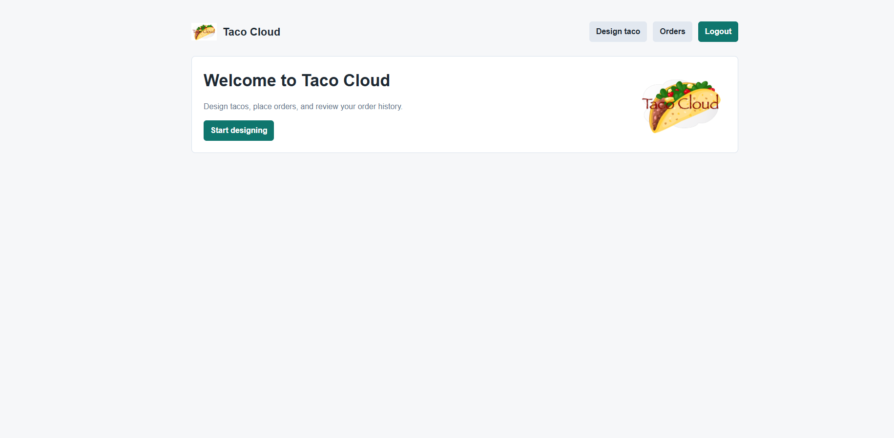
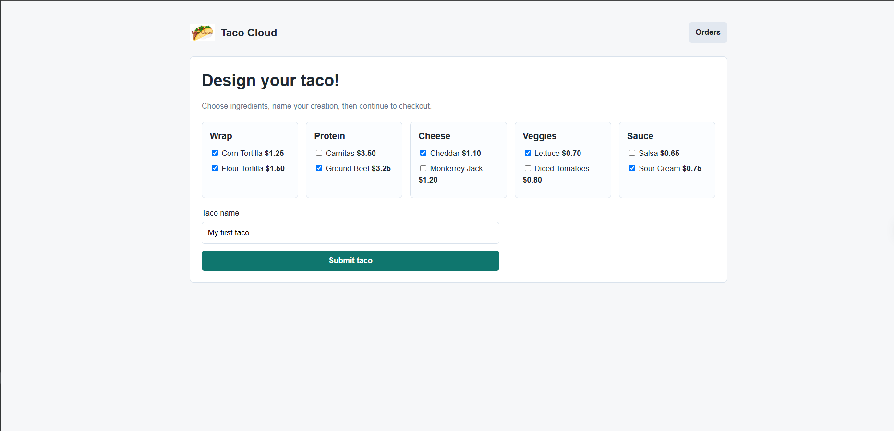
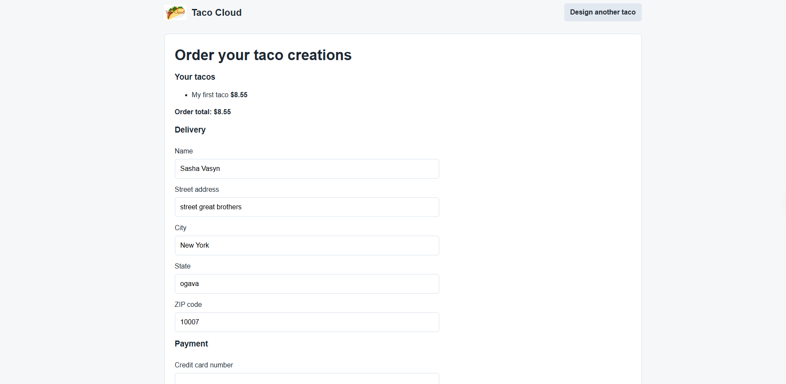
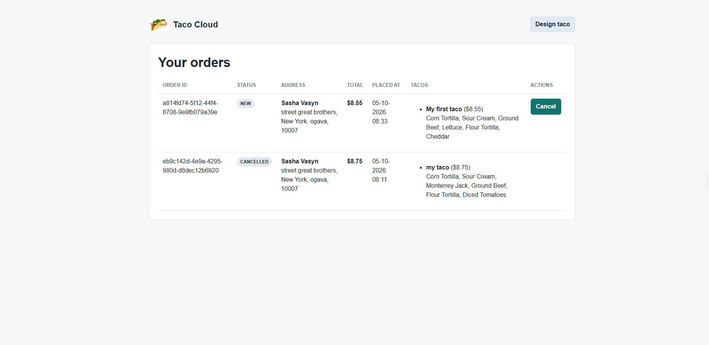
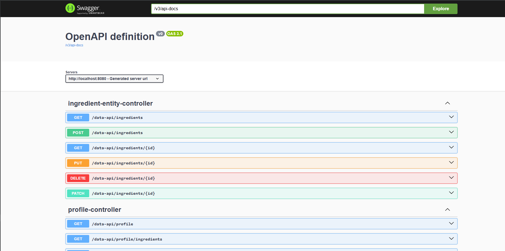

# Taco Cloud

A full-stack food-ordering web application built with Spring Boot. Users can create an account, assemble custom tacos, submit delivery orders, and track their order history. Administrators can manage the order lifecycle, while external clients can consume a documented REST API.

The project was originally based on the *Spring in Action* Taco Cloud domain and was extended into a portfolio project with authentication, roles, database migrations, Docker, Kafka messaging, REST APIs, OpenAPI documentation, automated tests, and CI.

## Highlights

- Secure registration and form login with BCrypt password hashing
- Role-based access control for customers and administrators
- Taco designer with categorized ingredients, validation, and calculated prices
- Checkout flow with delivery and payment-form validation
- Per-user order history and cancellation of newly created orders
- Admin dashboard for viewing orders, filtering by status, changing status, and clearing orders
- REST API for tacos, ingredients, and orders
- OAuth2 Resource Server protection for REST write operations using JWT scopes
- Flyway migrations for a versioned schema
- Optional Kafka event publishing when an order is created
- H2 profile for a fast local demo and MySQL + Kafka Docker Compose environment
- Swagger UI / OpenAPI documentation, JUnit + MockMvc tests, and GitHub Actions CI

> **Note:** Payment fields are validated and persisted only to demonstrate the checkout workflow. This is not a real payment integration and must not be used to process real card data.

## Tech Stack

| Area | Technologies |
|---|---|
| Language | Java 17 |
| Framework | Spring Boot 3.5, Spring MVC, Thymeleaf |
| Persistence | Spring Data JPA, MySQL 8.4, H2 |
| Database migrations | Flyway |
| Security | Spring Security, BCrypt, form login, JWT Resource Server |
| Messaging | Apache Kafka, Spring for Apache Kafka |
| API | REST, Spring Data REST, OpenAPI 3 / Swagger UI |
| Testing | JUnit 5, Spring Boot Test, MockMvc, Spring Security Test |
| Delivery | Docker, Docker Compose, GitHub Actions |

## Architecture and Request Flow

The application is a modular Spring Boot monolith. MVC controllers serve the Thymeleaf UI; REST controllers expose JSON endpoints; services contain ordering and administration rules; repositories access the relational database.

```text
Browser / API client
        |
        +--> Spring Security
        |
        +--> MVC controllers -> Services -> Spring Data JPA -> H2 or MySQL
        |
        +--> REST controllers -> Services / Repositories
                                      |
                                      +--> Kafka "orders" event (when enabled)
```

### Order lifecycle

1. A signed-in customer designs one or more tacos; the draft is kept in the HTTP session.
2. At checkout, server-side validation checks delivery, payment-form, and taco data.
3. `OrderService` saves the order with `NEW` status and associates it with the current user.
4. When messaging is enabled, an `OrderCreatedEvent` is published to the Kafka `orders` topic.
5. The customer can view their own orders and cancel an order while it is `NEW`.
6. An administrator can move an order through `NEW`, `PAID`, `IN_KITCHEN`, `READY`, `DELIVERED`, or `CANCELLED`.

## Screenshots

| Home | Taco designer |
|---|---|
|  |  |

| Checkout | Order history |
|---|---|
|  |  |



## Run Locally

### Prerequisites

- JDK 17+
- No external database is required for the default H2 mode

### 1. Clone and start

```bash
git clone https://github.com/Proggertopper/taco-cloud-spring-boot.git
cd taco-cloud-spring-boot
```

**Windows (PowerShell):**

```powershell
.\mvnw.cmd spring-boot:run
```

**macOS / Linux / Git Bash:**

```bash
./mvnw spring-boot:run
```

Open <http://localhost:8080>.

The default configuration starts with an in-memory H2 database, seeded ingredients, sample tacos, and a development administrator account:

```text
Username: admin
Password: admin123
```

Use this account only for local demonstration. Change or remove the seeded credentials before any real deployment.

### Local tools

| Resource | URL |
|---|---|
| Application | <http://localhost:8080> |
| H2 Console | <http://localhost:8080/h2-console> |
| Swagger UI | <http://localhost:8080/swagger-ui.html> |
| OpenAPI document | <http://localhost:8080/v3/api-docs> |

For the H2 console, use the JDBC URL shown in `application.properties` (by default, `jdbc:h2:mem:tacocloud`).

## Run the Full Stack with Docker Compose

Docker Compose starts the application, MySQL, and Kafka. In this mode the `mysql` Spring profile enables persistent MySQL storage and Kafka order events.

```bash
docker compose up --build
```

Then open <http://localhost:8080>.

Useful commands:

```bash
# Stop containers, keeping database and Kafka data
docker compose down

# Stop containers and remove persisted volumes
docker compose down -v
```

The MySQL service is exposed to the host on port `3308`:

```text
Host: localhost
Port: 3308
Database: tacocloud
Username: tacocloud
Password: tacocloud
```

These values are intended for local development. Use environment-specific secrets outside local development; `.env.example` documents the supported configuration variables.

## Configuration Profiles

| Profile | Database | Kafka events | Intended use |
|---|---|---|---|
| Default | In-memory H2 | Disabled | Fast local demo and tests |
| `mysql` | MySQL | Enabled | Docker Compose / local integration setup |
| `prod` | External MySQL via environment variables | Configurable | Deployment baseline |

To run against a locally available MySQL instance without Docker Compose:

```bash
SPRING_PROFILES_ACTIVE=mysql ./mvnw spring-boot:run
```

On Windows PowerShell:

```powershell
$env:SPRING_PROFILES_ACTIVE="mysql"
.\mvnw.cmd spring-boot:run
```

## API Overview

Public read endpoints:

| Method | Endpoint | Description |
|---|---|---|
| `GET` | `/api` | Recent tacos, paginated |
| `GET` | `/api/ingredients` | Available ingredients |

Protected API operations use a Bearer JWT:

| Method | Endpoint | Required authority |
|---|---|---|
| `GET` | `/api/orders` | Authenticated JWT |
| `POST` | `/api/orders` | Authenticated JWT |
| `PATCH` | `/api/orders/{id}/status?status=READY` | `SCOPE_admin` |
| `POST` | `/api/ingredients` | `SCOPE_writeIngredients` |
| `DELETE` | `/api/ingredients/{id}` | `SCOPE_deleteIngredients` |

`GET /data-api` exposes the Spring Data REST root and requires a signed-in browser session.

Interactive documentation and request schemas are available in Swagger UI after the application starts.

## Security

- Browser pages use session-based form login and CSRF protection.
- Passwords are stored with BCrypt hashing.
- `/design` and `/orders/**` are available to signed-in users and administrators.
- `/admin/**` requires `ROLE_ADMIN`.
- REST reads for tacos and ingredients are public; order API access and REST writes are secured through OAuth2 Resource Server JWT scopes.

## Database and Messaging

Flyway applies migrations from `src/main/resources/db/migration` before the application uses the schema. The data loader then creates the demo ingredient catalog, sample tacos, and the local administrator account when absent.

Kafka publishing is controlled with `TACOCLOUD_MESSAGING_ENABLED`. With Docker Compose it is enabled, and each created order produces an `OrderCreatedEvent` on the `orders` topic. The included listener logs the event as a kitchen-side consumer simulation.

## Tests and CI

Run the automated test suite:

```bash
./mvnw test
```

Windows PowerShell:

```powershell
.\mvnw.cmd test
```

Tests cover application startup, public and protected MVC routes, JWT-scoped API writes, order creation, input validation, order history, customer cancellation, and admin status updates.

GitHub Actions runs the Maven test suite on pushes and pull requests targeting `main` or `master`.

## Project Structure

```text
src/main/java/tacos/
├── security/       # Spring Security configuration and registration
├── web/            # MVC controllers, REST controllers, view configuration
├── service/        # Ordering and administration business logic
├── data/           # Spring Data repositories
├── messaging/      # Kafka order event producer and consumer
└── domain classes  # Taco, Ingredient, TacoOrder, User, OrderStatus

src/main/resources/
├── db/migration/   # Flyway schema migrations
├── templates/      # Thymeleaf pages
└── application*.properties
```

## Build a Runnable JAR

```bash
./mvnw clean package
java -jar target/taco_cloud2-0.0.1-SNAPSHOT.jar
```
